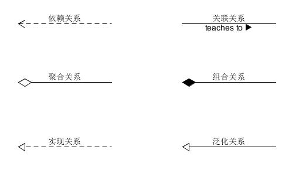
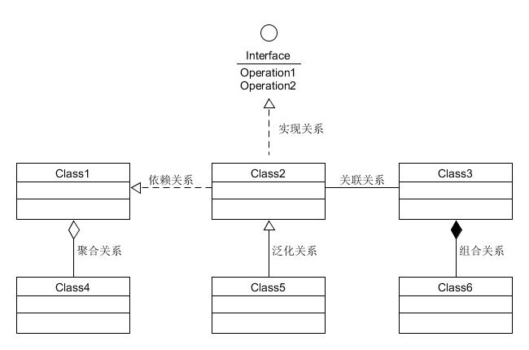
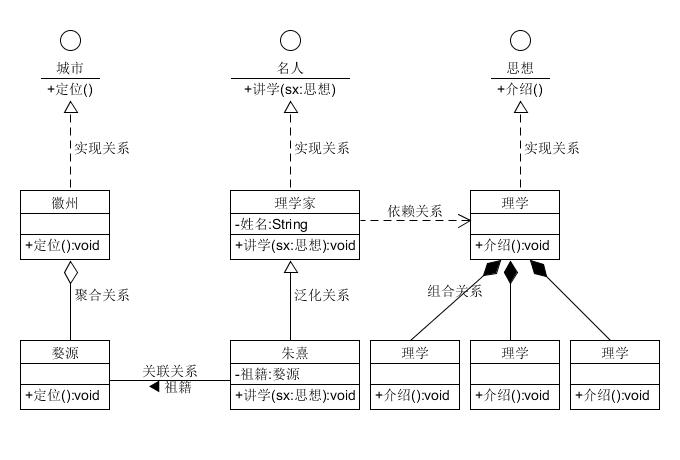

# exercise
平时学习练习之用

设计模式学习

Java设计模式学习：https://www.cnblogs.com/Young111/p/10690599.html
软件设计模式概述：http://c.biancheng.net/view/1317.html

	分为三大类：
	1.创建型模式:
	(1)单例模式:饿汉式,类加载时变创建单例对象用于使用,简单易懂,影响系统启动加载效率;懒汉式,当单例对象使用到时才会创建单例对象,但多线程时注意同步
	的使用,需注意volatile和sychronized关键字的使用;
	(2)工厂方法:只有一个工厂,生产不同的类对象实例,当需要添加不同的产品时需要对工厂进行修改;
	(3)抽象工厂:多个工厂,需要添加产品时只需添加修改相应工厂即可;
	(4)原型模式:利用重写Object类的clone获取对象的复制,也可对复制对象的属性进行重写覆盖;
	(5)建造者模式:对象的拼接创建(各构件组成成品).
	2.结构型模式:
	(1)代理模式;
	(2)适配器模式;
	(3)桥接模式;
	(4)装饰模式;
	(5)外观模式;
	(6)享元模式;
	(7)组合模式.
	3.行为型模式:
	(1)策略模式;
	(2)命令模式;
	(3)责任链模式;
	(4)状态模式;
	(5)观察者模式;
	(7)中介者模式;
	(8)迭代器模式;
	(9)访问者模式;
	(10)备忘录模式:回滚;
	(11)解释器模式.

	UML:类之间的关系,依赖关系,相关关系,聚合关系,组合关系,实现关系,泛化关系.	
	

